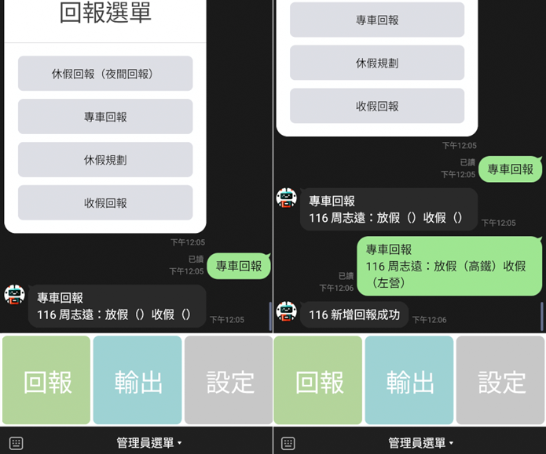

## 這是我在當兵期間寫的一個回報機器人，因為已經退伍，所以發布出來給有需要的人使用。

這是一個基於 LINE Bot 的回報系統，專門用於國軍當兵時的各種回報，如休假、夜間回報等。<br>


## 功能特點

### 基本功能
- 身份權限管理（一般/管理員）
- 基於 Rich Menu 與 Flex Message 的選單系統
- 自動化資料清理
<br>

### 回報項目
- 休假回報（夜間回報）
- 專車回報
- 休假規劃 
- 收假回報
<br>

### 管理功能
- 未回報人員查詢
- 已回報統計
- 專車統計
- 管理員設定
<br>

## 系統架構
```
├── api/                   # API 相關模組
│   ├── line_api.py        # LINE Bot API 操作
│   └── notify_api.py      # LINE Notify API 操作
├── handlers/              # 處理模組
│   ├── datahandler.py     # 資料處理
│   ├── eventhandler.py    # 事件處理
│   └── jobhandler.py      # 排程處理
├── menu/                  # 選單相關
│   ├── mainlist_*.json    # 主選單配置
│   └── *list_*.json       # 其他選單配置
├── models/                # 模型定義
│   └── menu.py            # Rich Menu 模型
├── utils/                 # 工具模組
│   └── config.py          # 設定檔
├── bot_async.py           # 主程式
│
└── students_data.json     # 人員資料
```
<br>

## 系統需求
- Python 3.9+
<br>

## 安裝步驟
範例中使用的人名皆為隨機產生，並非真實姓名
<br>

1. 複製專案<br>
```sh
git clone https://github.com/wonk2563/ReportBot.git
cd ReportBot
```

2. 安裝相依套件<br>
```sh
pip install -r requirements.txt
```

3. 設定環境變數<br>
```sh
cp .env.example .env
```
編輯 .env 檔案並填入以下資訊：<br>
- CHANNEL_SECRET：LINE Bot 的 Channel Secret<br>
- CHANNEL_ACCESS_TOKEN：LINE Bot 的 Channel Access Token<br>

4. 設定 Webhook
在 [LINE Bot Console](https://developers.line.biz/console) 中，將 Webhook URL 設定為 `http://your-domain:5000/callback`<br>
若是架設在本地端，建議可使用 [ngrok](https://ngrok.com) 進行轉發<br>


5. 設定人員資料
編輯 `students_data.json` 將人員資料如下格式，依照學號填入<br>
只需填入 `學號`（如 116 ~ 118） 以及 `name`（名字） 就好<br>
```json
{
    "116": {
        "uid": "",
        "name": "\u5468\u5fd7\u9060",
        "nightReport": "",
        "vacationReport": "",
        "closeReport": "",
        "busReport": "",
        "isAdmin": false
    },
    "117": {
        "uid": "",
        "name": "\u6797\u660e\u6770",
        "nightReport": "",
        "vacationReport": "",
        "closeReport": "",
        "busReport": "",
        "isAdmin": false
    },
    "118": {
        "uid": "",
        "name": "\u5f35\u5bb6\u8c6a",
        "nightReport": "",
        "vacationReport": "",
        "closeReport": "",
        "busReport": "",
        "isAdmin": false
    }
}
```

6. 啟動服務<br>
```sh
python bot_async.py
```

服務將在 `http://localhost:5000` 運行
<br>

## 使用方式

### 首次使用
1. 加入 LINE Bot 好友，會自動發送選單，請選擇學號、姓名<br>


2. 第一位使用者會被發送管理員設定選單，點選後即可獲得管理員權限<br>


3. 獲得管理員權限後，可透過選單中的設定來進行多項操作<br>

<br>

### 設定選單說明
1. 設定班級：設定目前機器人管理的班級，用於後續產生輸出回報<br>


2. 新增管理員：將指定人員設定為管理員<br>


3. 輸出 UID：獲取目前已設定 UID 之所有人員<br>


4. 暫停排程：暫停自動將資料清空的排程

5. 恢復排程：恢復自動將資料清空的排程

6. 廣播：將指定內容廣播給所有人員<br>
目前已停止廣播功能，需改為使用 Message API
<br>

### 回報選單說明
所有回報項目點擊後，機器人都會回傳回報範例，<br>
將範例複製後，填入回報內容並發送，即可完成回報<br>

1. 休假回報（夜間回報）<br>


2. 專車回報<br>


3. 休假規劃<br>


4. 收假回報<br>

<br>

### 輸出選單說明

<br>

1. 未回報人員查詢：查詢未回報的人員清單，並依據人名自動產生標註<br>


2. 回報統計：統計已回報的人員清單，並依據學號順序排列<br>

<br>

### 排程說明
1. 每天中午 12:00 時自動將休假回報（夜間回報）資料清空<br>

2. 每週三晚上 23:00 時自動將收假回報資料清空<br>

3. 每週四晚上 23:00 時自動將專車回報資料清空<br>

4. 每週日晚上 23:00 時自動將休假規劃資料清空<br>

相關設定請參考 [schedule.py](handlers/jobhandler.py) 檔案


## 授權協議

本專案採用 MIT 授權 - 詳見 [LICENSE](LICENSE)